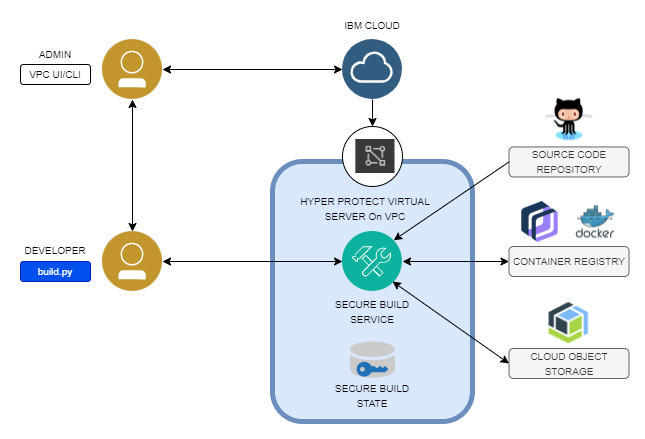

The following diagram illustrates a high level structure of Secure Build Server (SBS), which is provisioned by an administrator by using the [IBM Cloud VPC UI](https://cloud.ibm.com/vpc-ext/compute/vs) or [IBM Cloud VPC CLI](https://cloud.ibm.com/docs/vpc?topic=vpc-creating-vpc-resources-with-cli-and-api&interface=cli).

This document describes how a developer can interact with the server by using the `build.py` script. A developer prepares the source code of an application by using Dockerfile, in a source code repository such as GitHub. The secure build server pulls the source code, builds a container image by using the Dockerfile, signs it, and pushes it to a container registry, such as Docker Hub or IBM Cloud Container Registry (ICR). During the build process, it also creates a manifest file and signs it.

Optionally, it can push the manifest to IBM Cloud Object Storage, or the developer can download it on a local file system. The build server can also export and import its state as a single file, which includes the signing keys of the image and the manifest, with build parameters. When exported, the state is encrypted and neither the developer or IBM can decrypt the state image outside the enclave. It can be decrypted only within the enclave. The encrypted state image can be pushed to IBM Cloud Object Storage, or the developer can download it on a local file system

<p align="center">
  
</p>


## Before you begin

Ensure that you meet the following hardware or software requirements:
- Linux management server from where you can run the build CLI tool (Linux workstation or VM).
  - x86 architecture (recommended 2 CPUs/4GB memory or more)
  - Ubuntu 20.04 or 18.04 (64 bit)
  - Python 3.8 (Python 2.x is not supported)
- Access to GitHub, for hosting the source code.
- Dockerfile (everything that you need to build your container image).
- Access to IBM Cloud Registry or DockerHub.
- (Optional) Access to IBM Cloud Object Storage (COS) Service.
- Access to IBM Hyper Protect Virtual Servers for VPC.
- Get the encrypted workload section of the contract file of Secure Build Server from [step 2](https://cloud.ibm.com/docs/vpc?topic=vpc-about-hpsb#hpvs_hpsb).


## Install the Secure Build CLI
The CLI script is written in Python and has been tested using Python 3.6.9. You must install Python3 and pip3, if you don't have them on your client system. The `build.py` is the main script that comes with secure-build-cli. This script helps you to interact and complete the required operations on the SBS instance after it is created by using the IBM Cloud CLI. For systems that run Ubuntu, you can run the following commands to install them:
```
apt-get update
apt-get install python3 python3-pip
python3 -m pip install -U pip
```

After you run the complete running the commands listed above, clone the repository and install the dependencies by running the following commands:

```
git clone git@github.com:ibm-hyper-protect/secure-build-cli.git
cd secure-build-cli
pip3 install -r requirements.txt
```


## Preparing the configuration
Create the `sbs-config.json` file in any location that you choose on your local machine, and add the following content to the file:
```
{
  "HOSTNAME": "sbs.example.com",
  "CICD_PORT": "443",
  "IMAGE_TAG": "",
  "CONTAINER_NAME": "SBContainer",
  "GITHUB_KEY_FILE": "~/.ssh/id_rsa",
  "GITHUB_URL": "git@github.com:<git_user>/<git_repo>.git",
  "GITHUB_BRANCH": "master",
  "DOCKER_REPO": "<docker_namespace>/<docker_repository_name>",
  "DOCKER_USER": "<docker_user>",
  "DOCKER_PASSWORD": "<docker_password>",
  "IMAGE_TAG_PREFIX": "<docker_image_tag>",
  "DOCKER_CONTENT_TRUST_BASE": "False",
  "DOCKER_CONTENT_TRUST_BASE_SERVER": "",
  "DOCKER_RO_USER": "<docker_user>",
  "DOCKER_RO_PASSWORD": "<docker_password>",
  "DOCKER_BASE_USER": "",
  "DOCKER_BASE_PASSWORD": "",
  "ICR_BASE_REPO": "",
  "ICR_BASE_REPO_PUBLIC_KEY": "",
  "ENV_WHITELIST":  ["<KEY1>", "<KEY2>"],
  "ARG": {
    "<BUILD_ARG1>": "<VALUE1>",
    "<BUILD_ARG2>": "<VALUE2>"
  }
}
```

Where
```
HOSTNAME - Hostname of the SBS server which will be used while generating certificates and communicating with the secure build server.
CICD_PORT - port on which a build service is running (default: 443).
IMAGE_TAG - image tag of the container image to be deployed as SBS server. Use "1.3.0.9" unless otherwise noted.
CONTAINER_NAME - Name of the IBM Cloud Hyper Protect Secure Build Server instance which you want to create on VPC. This name can be different from the name which you use on VPC. The name is used as a part of a certificate file name. You can choose any valid string as a file name.
GITHUB_KEY_FILE - Private key path to access your GitHub repo.
GITHUB_URL - GitHub URL.
GITHUB_BRANCH - GitHub branch name.
DOCKER_REPO - DockerHub repository.
DOCKER_USER - docker user name who has write access to above repository.
DOCKER_PASSWORD - docker password who has write access to above repository.
IMAGE_TAG_PREFIX - a prefix of the image tag for the image to be built. The full image tag will be IMAGE_TAG_PREFIX + '-' + the leading seven digits from the GitHub repository hash.
DOCKER_CONTENT_TRUST_BASE - If your base image that is mentioned in the Dockerfile is signed, then make it true.
DOCKER_CONTENT_TRUST_BASE_SERVER - If your base image mentioned in the Dockerfile is signed, then you can specify the notary URL (default: https://notary.docker.io).
DOCKER_BASE_USER - docker user name of repository which has base image.
DOCKER_BASE_PASSWORD - docker password of repository which has base image.
DOCKER_RO_USER - you can use the same as DOCKER_USER. It is recommended that you specify a user who has read access only to your Docker repository.
DOCKER_RO_PASSWORD - you can use same as DOCKER_PASSWORD. It is recommended that you specify a user who has read access only to your Docker repository.
ENV_WHITELIST - All environment variable names need to be listed. The Hyper Protect Virtual Servers don't allow any environment variable unless it is in this list because of a security reason.
ARG - You have to pass all build argument parameters as you pass during Docker build.
ICR_BASE_REPO - Base Image used in dockerfile if it is present in ICR
ICR_BASE_REPO_PUBLIC_KEY - public key with which the base image used in docker file (ICR_BASE_REPO) is signed
```
Note:
- If you use IBM Cloud Registry instead of DockerHub registry, then you must use the following parameters:
  ```buildoutcfg
  "DOCKER_BASE_SERVER": "<domain_name>",
  "DOCKER_PUSH_SERVER": "<domain_name>",
  "DOCKER_USER": "iamapikey",
  "DOCKER_PASSWORD": "<ibm_cloud_apikey>"
  "DOCKER_RO_USER": "iamapikey",
  "DOCKER_RO_PASSWORD": "<ibm_cloud_apikey>",
  "DOCKER_CONTENT_TRUST_PUSH_SERVER": "https://<domain_name>"
  ```

  - The `<domain_name>` specifies the location of IBM Cloud Container Registry (e.g. `us.icr.io`). Select the domain name for one of [available regions](https://cloud.ibm.com/docs/Registry?topic=Registry-registry_overview#registry_regions).
  - If you are using the IBM Cloud Registry server, and you specified the `<domain_name>` as `us.icr.io`, then specify `us.icr.io` as the value for `DOCKER_CONTENT_TRUST_PUSH_SERVER`. As another example, if value of `DOCKER_REPO=de.icr.io`, then the value of `DOCKER_CONTENT_TRUST_PUSH_SERVER` should be `de.icr.io`. To know more about IBM Cloud registry, see [Getting started with IBM Cloud Container Registry](https://cloud.ibm.com/docs/Registry?topic=Registry-getting-started).

- If the base image used in Docker file is signed, configure "DOCKER_CONTENT_TRUST_BASE" with a value "True". And configure "DOCKER_BASE_USER" and "DOCKER_BASE_PASSWORD" with the credentials.
  - If the base image is on Docker Hub and DCT signed, "DOCKER_CONTENT_TRUST_BASE_SERVER" is set with the notary server URL https://notary.docker.io.
  - If the base image is on IBM Cloud Container Registry and Red Hat Simple Signed, "DOCKER_CONTENT_TRUST_BASE_SERVER" is set with <domain_name>.
  - If the base image is on IBM Cloud Container Registry and Red Hat Simple Signed, you must provide the 'ICR_BASE_REPO', and 'ICR_BASE_REPO_PUBLIC_KEY' parameters. The following is an example for these two values:
    - "ICR_BASE_REPO": `"<region>.icr.io/<repo name>/<image name>:<tag>"`
    - "ICR_BASE_REPO_PUBLIC_KEY" : `"<path to the public key>"`

- If the base image used in Docker file is unsigned, set "DOCKER_CONTENT_TRUST_BASE" to "false". Also, you don't have to set "DOCKER_CONTENT_TRUST_BASE_SERVER".
   - If the base image is on IBM Cloud Container Registry, the "DOCKER_BASE_USER" and "DOCKER_BASE_PASSWORD" must be set.
   - If the base image is on Docker Hub and is private, you must set the "DOCKER_BASE_USER" and "DOCKER_BASE_PASSWORD". Otherwise, you don't have to set the "DOCKER_BASE_USER" and "DOCKER_BASE_PASSWORD" parameters.

- To update the instance with a new certificate when the old certificate expires, complete the following steps:
  1. Take a snapshot of the data volume of the instance, by following [these](https://cloud.ibm.com/docs/vpc?topic=vpc-snapshots-vpc-create&interface=ui) instructions.

  2. Generate the new certificates by following the commands
    ```
    ./build.py create-client-cert --env sbs-config.json
    ```
    and
    ```
    ./build.py create-server-cert --env sbs-config.json
    ```
  3. Run the following command to get the new certificate:
     ```
     ./build.py instance-env --env sbs-config.json
     ```
  4. Generate a new contract for SBS by using the above certificates. For more information, see [ENV section of the contract](SBS-VPC.md#an-example-of-the-env-section-of-the-contract).

  5. Create a new SBS container using the above snapshot as a data volume. For more information, see [Creating virtual server instances](https://cloud.ibm.com/docs/vpc?topic=vpc-creating-virtual-servers&interface=ui).

Also see [Additional Build Parameters](additional-build-parameters.md).


## Deploying the Secure Build Server

Complete the following steps:


1. Configure the `sbs-config.json` file with certificates by using one of the following options.
   1. Use build.py to create certificate-authority (CA) and client certificates which are used for secure communication from your client script to the SBS instance.
      ```buildoutcfg
      ./build.py create-client-cert --env <path>/sbs-config.json
      ```
      After you execute above command, a directory is generated that looks like this: `.SBContainer-9ab033ad-5da1-4c4e-8eae-ca8c468dbbcc.d`.
      You will notice that two parameters "UUID" and "SECRET", are added to the `sbs-config.json` file.
      UUID is used along with the container name where the generated certificates are stored.
      SECRET holds a randomly generated value, which needs to be preserved safely, and is used to deal with the state image of SBS. Continue to step #4.
      Note:-
      - Follow the best practices of certificate management.
      - The CA certificate should not be compromised or revoked.
      - Third-party certificates are not supported.

   2. Use your own certificate-authority (CA) and client certificates.
      1. Go to the CLI directory. If it is located at `~/git`, run the following command:
         ```
         cd ~/git/secure-build-cli
         ```
      2. Add the following path names to the  `sbs-config.json` file.
         Note that the `server-csr.pem` and `server-cert.pem` do not exist as yet. If the `./sbs-keys` directory does not exist, you can create one by using the command `mkdir ./sbs-keys`.
         ```
         "CAPATH": "Path to CA certificate",
         "CAKEYPATH": "Path to CA key",
         "CLIENT_CRT_KEY": "Path to concatenated client cert and key",   //cat my-client-cert.pem my-client-cert-key.pem > my-client-cert-and-key.pem
         "CSRPATH": "./sbs-keys/server-csr.pem",
         "CERTPATH": "./sbs-keys/server-cert.pem",
         ```
         Note:-
         - Follow the best practices of certificate management.
         - The CA certificate should not be compromised or revoked.
         - Third-party certificates are not supported.

2. Use build.py to create the server certificate signed by the CA certificate generated that was generated in the previous  step. It will be setup on the server for secure communication.
      ```buildoutcfg
      ./build.py create-server-cert --env <path>/sbs-config.json
      ```

3. Get the environment key value pair to be used in instance-create command by running the following command.
```buildoutcfg
./build.py instance-env --env <path>/sbs-config.json
```

Note the values of CLIENT_CRT, CLIENT_CA, SERVER_CRT, SERVER_KEY

4. Generate a contract with the `workload` and `env` sections. For more in about creating the contract, see [About the contract](https://cloud.ibm.com/docs/vpc?topic=vpc-about-contract_se).

## An example of the ENV section of the contract

```
env: |
  type: env
  logging:
    logDNA:
      hostname: <host name of the Log Analysis instance>
      ingestionKey: **********************************
      port: 14XX
  volumes:
    hpsb:
      seed: "testing"
  env:
    CLIENT_CRT: LS0tLS1CRUdJTiBDRVJUSUZJQ0FURS0tLS0tCk1JSUR3RENDQXFpZ0F3SUJBZ0lFQmR6U1VEQU5CZ2txaGtpRzl3MEJBUXNGQURCbU1Rc3dDUVlEVlFRR0V3SlYKVXpFTE1Ba0dBMVVFQ0F3Q1Rsa3hEekFOQmdOVkJB.....................
    CLIENT_CA: LS0tLS1CRUdJTiBDRVJUSUZJQ0FURS0tLS0tCk1JSUR4akNDQXE2Z0F3SUJBZ0lFQlhVeUt6QU5CZ2txaGtpRzl3MEJBUXNGQURCbU1Rc3dDUVlEVlFRR0V3SlYKVXpFTE1Ba0dBMVVFQ0F3Q1Rsa3hEekFOQmdOVkJB......................
    SERVER_CRT: LS0tLS1CRUdJTiBDRVJUSUZJQ0FURS0tLS0tCk1JSUQwakNDQXJxZ0F3SUJBZ0lFQkVhUVZ6QU5CZ2txaGtpRzl3MEJBUXNGQURCbU1Rc3dDUVlEVlFRR0V3SlYKVXpFTE1Ba0dBMVVFQ0F3Q1Rsa3hEekFOQmdOVkJBY01Ca0Z5Ylc5dWF6RU1NQW9HQTFVRUNnd0RTVUpOTVJjdwpGUVlEVlFRTERBNUVhV2RwZEdGc0lFRnpjMlYwY3pFU01CQUdBMVVFQXd3SlEyeHBaVzUwSUVOQk1CNFhEVEl5Ck1Ea3lOekEyTlRreE1Wb1hEVEl6TURr......................
    SERVER_KEY: LS0tLS1CRUdJTiBQR1AgTUVTU0FHRS0tLS0tCgpoUUVNQTJ0VkVob1VkT2cvQVFnQWpRMFBuVGp3VklsZCtKY2pCSXNIRVAxNjMxcXQyd2szNHV4ZjkrZUJjaXRwCi8yZ0RJY01kSDU0MHZ6T0NBeG96RWh6bDJDTmw1S2xVbk1DdWtXTHFoTmRoNTVtanIvK1E2TzRNdkREeXhaKysKRUhhS29lVGduYmZlWVZacXBNUGdqU04wVmgrTHNDNG5QQ2xQYzg1SEJVZXFDSmlZcWpkMSs0L1NtMmtpUy8yRQpCaWxTV1BoN0h2Y1N6THVTYklxTTFi......................
```

5. To prepare the env section of the contract, see [How to prepare the ENV section](https://cloud.ibm.com/docs/vpc?topic=vpc-about-contract_se#hpcr_contract_env).

6. The `env` section of the contract must be encrypted. For more information, see [Encrypting the ENV Contents](https://cloud.ibm.com/docs/vpc?topic=vpc-about-contract_se#hpcr_contract_encrypt_env).

**Note:** It is recommend that you encrypt the `env` section of the contract.

7. You can get the encrypted workload section of the contract from [step 2](https://cloud.ibm.com/docs/vpc?topic=vpc-about-hpsb#hpvs_hpsb).

8. Combine the `encrypted env` section and the `encrypted workload` section and add the contents to the `user-data.yaml` file that is used for deployment.

9. After you complete preparing the contract that is used for bring up the SBS Container on Hyper Protect Virtual Servers for VPC, follow [these instructions](https://cloud.ibm.com/docs/vpc?topic=vpc-creating-virtual-servers&interface=ui) to create the Hyper Protect Virtual Servers for VPC instance.


10. Ensure that the floating IP of the container is mapped with the hostname in `/etc/hosts` file that was given during the certificate creation.
```
Example: 169.XX.XXX.XXX sbs.example.com
```
**Note:** Enable security groups in Hyper Protect Virtual Servers for VPC, which should accept port 443 in inbound rules.


## How to build image by using SBS
After you create the SBS instance, complete the following steps to build your image securely:

1. Check the status of SBS.
```buildoutcfg
./build.py status --env <path>/sbs-config.json
INFO:__main__:status: response={
    "status": ""
}
```
2. Initialize the configuration.
```buildoutcfg
./build.py init --env <path>/sbs-config.json
```
3. Build the image.
```buildoutcfg
./build.py build --env <path>/sbs-config.json
```
4. Check the build log.
```buildoutcfg
./build.py log --log build --env <path>/sbs-config.json
```
5. Check whether the image has been built and pushed successfully.
```buildoutcfg
./build.py status --env <path>/sbs-config.json
```
As the build progresses, the `status` response shows the last completed step.
Here is a typical sequence of responses for a successful build.
```
{
  ...
    "status": "cleaned up"
}
{
  ...
    "status": "github cloned"
}
{
  ...
    "status": "image built"
}
{
  ...
    "status": "image pushed"
}
{
  ...
    "status": "success"
}
```
When an error occurs, the `status` response shows the command that caused the error. Typically, you need to examine the build log to fix the issue.
```
{
  ...
    "status": "exiting due to a non-zero return value: 1, cmd: docker build --disable-content-trust=false -t docker.io/<user_name>/nginxapp:latest -f Dockerfile ."
}
```
To stop a long-running build process, refer to [How to stop and clean up a build process](SBS-VPC.md#how-to-stop-and-clean-up-a-build-process).


## How to deploy the image that is built by using SBS
1. After the image is built by SBS to bring up as a container on a HPCR environment use the following command and obtain the digest value of the image and prepare the docker-compose file.

```
Ex: ./build.py get-digest --env sbs-config.json
Digest value of the built image: docker.io/<namespace>/sbsfinal@sha256:72e9976c7693140bbea851ea360...................
```

```
Ex:
version: '3'
services:
  sample:
    image: docker.io/<namespace>/sbsfinal@sha256:72e9976c7693140bbea85.............
```

2. For the images that are built by SBS and are DCT signed, run the following command to obtain the public key. For more information, see [Images subsection](https://cloud.ibm.com/docs/vpc?topic=vpc-about-contract_se#hpcr_contract_images).
```
./build.py get-signed-image-publickey --env <path>/sbs-config.json
```

3. Create a archive file for the above docker-compose file. For more details, see [Preparing the docker-compose file](https://cloud.ibm.com/docs/vpc?topic=vpc-about-contract_se#step3) and generate both the `workload`, and `env` sections of the contract and bring up the container on Hyper Protect Virtual Servers for VPC. For more information about the generating the contract, see [About the contract](https://cloud.ibm.com/docs/vpc?topic=vpc-about-contract_se).


## Manifest file
The SBS instance creates a manifest file at each successful build as a snapshot of build materials for audit purposes. The developer can verify the integrity of the built image and the artifacts used for building the image. Using this Manifest file is optional.

## How to store Manifest file in IBM Cloud Object Storage

1. Add the following parameters to your `sbs-config.json` file.
```buildoutcfg
    "COS_API_KEY_ID": "<your_cloud_apikey>",
    "COS_RESOURCE_CRN": "<your_cloud_resource_crn_id>",
    "COS_ENDPOINT": "<your_public_cos_endpoint>",
    "COS_AUTH_ENDPOINT": "https://iam.cloud.ibm.com/oidc/token",
    "MANIFEST_BUCKET_NAME": "<your_bucket_name>",
```
`COS_ENDPOINT` specifies the public endpoint of your COS instance (e.g. https://s3.us-east.cloud-object-storage.appdomain.cloud). Don't forget the leading `https://`.
You need to create the bucket specified by `MANIFEST_BUCKET_NAME` if it doesn't exist.

2. Update the SBS instance with the new COS parameters.
```buildoutcfg
./build.py update --env <path>/sbs-config.json
```

3. Build the image.
```
./build.py build --env <path>/sbs-config.json
```

This will store your manifest file to IBM Cloud Object Storage.


## How to get the Manifest file

1. Get the latest manifest file directly from SBS.
```buildoutcfg
./build.py get-manifest --env <path>/sbs-config.json
```

This will store your manifest file to current working directory, something similar to `manifest.docker.io.<user_name>.nginxapp.v1-d14cdc8.2021-02-04_13-25-52.512466.sig.tbz`.

2. Verifying the integrity of the Manifest file
```buildoutcfg
./build.py get-manifest --env <path>/sbs-config.json  --verify-manifest
```

## How to extract build materials from the Manifest file

Untar by using the `tar` command.
```buildoutcfg
tar -xvf manifest.docker.io.<user_name>.nginxapp.v1-d14cdc8.2021-02-04_13-25-52.512466.sig.tbz
manifest.docker.io.<user_name>.nginxapp.v1-d14cdc8.2021-02-04_13-25-52.512466.tbz
manifest.docker.io.<user_name>.nginxapp.v1-d14cdc8.2021-02-04_13-25-52.512466.sig
```

Further untar to get the build materials.
```buildoutcfg
tar -xvf manifest.docker.io.<user_name>.nginxapp.v1-d14cdc8.2021-02-04_13-25-52.512466.tbz
```

You will see a data and git folder.
- The data directory provides the `build.json` and `build.log` files which contain the build status and the build log, respectively.
- The git directory contains the snapshot of the cloned git repository of the source code on the SBS instance when the build was completed.


## State image
The state image contains the private signing key, which is generated when a built image is pushed to a container registry for the first time. It is encrypted by using two SECRETS. One is generated by `build.py` and stored in your `sbs-config.json`. The other one is included in the SBS image.

Why do we need the state image?
You need it to recover the signing key and additional SBS internal states to build the image in a new SBS instance after the original instance is deleted or corrupted.

## How to get the state image

1. Get the state image locally.
```buildoutcfg
./build.py get-state-image --env <path>/sbs-config.json
```
There will be an encrypted file which will be downloaded in your current directory, similar to this:
```buildoutcfg
docker.io.<user_name>.sbs22.s390x-v0.1-60fd72e.2020-10-21_07-20-08.516797
```

2. You can also save the state image to IBM Cloud Object Storage (COS).

    1) You first create a bucket on IBM Cloud Object Storage.

    2) Add below parameters into `sbs-config.json`.

      ```buildoutcfg
      "COS_API_KEY_ID": "<your_cloud_apikey>",
      "COS_RESOURCE_CRN": "<your_cloud_resource_crn_id>",
      "COS_ENDPOINT": "<your_public_cos_endpoint>",
      "COS_AUTH_ENDPOINT": "https://iam.cloud.ibm.com/oidc/token",
      "STATE_BUCKET_NAME": "<your_bucket_name>",
      ```

      If you already have COS parameters for the manifest in `sbs-config.json`, add `STATE_BUCKET_NAME` only.

    3) Update the configuration.

      ```buildoutcfg
      ./build.py update --env <path>/sbs-config.json
      ```

    4) Save the state image to COS.

      ```buildoutcfg
      ./build.py get-state-image --env <path>/sbs-config.json {--state-bucket-name <your_bucket_name>}
      ```

      Use the `--state-bucket-name` option, if you want to override the parameter in `sbs-config.json` or you don't have one in the file.
      When you save the state image to COS, you still get meta data of the state image in a local file of the same name as the state image file.


## How to recover the state image
Complete the following steps:

1. Create a new SBS instance as mentioned in the section [Deploying the Secure Build Server](SBS-VPC.md#deploying-the-secure-build-server), with the same secret that was used to get the state image, otherwise the post state image operation fails.

2. Map the Public IP address with the hostname provided for the server in /etc/hosts file.
```buildoutcfg
169.XX.XXX.XXX sbs.example.com
```

3. Check the status of SBS.
```buildoutcfg
./build.py status --env <path>/sbs-config.json
```
4. Post the state image.
```buildoutcfg
./build.py post-state-image --state-image docker.io.<user_name>.sbs22.s390x-v0.1-60fd72e.2020-10-21_07-20-08.516797 --env <path>/sbs-config.json
```
Use the `--state-image` option to specify the state image file you downloaded previously with the `get-state-image` command.

5. Update the configuration.
```buildoutcfg
./build.py update --env <path>/sbs-config.json
```

6. Now you can further build your image using build command. Eventually your Docker image will be pushed to same registry.
```buildoutcfg
./build.py build --env <path>/sbs-config.json
```

7. Check the build log and wait until the build operation is completed.
```buildoutcfg
./build.py log --log build --env <path>/sbs-config.json
```

8. Check the status of the container.
```buildoutcfg
./build.py status --env <path>/sbs-config.json
```


## How to recover the state image from Cloud Object Storage
Complete the following steps:

1. Create a new SBS server as mentioned in the section [Deploying the Secure Build Server](SBS-HPVScloud.md#deploying-the-secure-build-server), and use the same secret that was used to get the state image, otherwise the post state image operation fails.

2. Make sure the floating IP of the container should be mapped with the hostname in `/etc/hosts` file given during the certificate creation.
```
Ex: 169.XX.XXX.XXX sbs.example.com
```

3. Check the status of SBS.
```buildoutcfg
./build.py status --env <path>/sbs-config.json
```

4. Use the same `sbs-config.json` file.

5. Initialize the configuration.
```buildoutcfg
./build.py init --env <path>/sbs-config.json
```

6. Post the state image.
```buildoutcfg
./build.py post-state-image --env <path>/sbs-config.json --name docker.io.<user_name>.sbs22.s390x-v0.1-60fd72e.2020-10-21_07-20-08.516797 {--state-bucket-name <your_bucket_name>}
```
Use the `--state-bucket-name` option, if you want to override the parameter in `sbs-config.json` or you don't have one in the file.
Use the `--name` option to specifiy the name of the state image on COS, which is the same as the name of the meta data file you downloaded with the `get-state-image` command.

7. Update the configuration.
```buildoutcfg
./build.py update --env <path>/sbs-config.json
```
8. You can build your image using build command. Eventually your Docker image will be pushed to same registry.
```buildoutcfg
./build.py build --env <path>/sbs-config.json
```
9. Check the build log and wait until the build operation is completed.
```buildoutcfg
./build.py log --log build --env <path>/sbs-config.json
```
10. Check the status of SBS.
```buildoutcfg
./build.py status --env <path>/sbs-config.json
```

## How to stop and clean up a build process
SBS can take one build task at a time. If you want to start another build before an on-going
build completes successfully or prematurely with an error, you need to stop and clean up
the on-going build first.

1. You can always check the status of SBS using the `status` command.
```buildoutcfg
./build.py status --env <path>/sbs-config.json
```

2. Clean up SBS if you want to run another build without waiting for an on-going build to complete.
```buildoutcfg
./build.py clean --env <path>/sbs-config.json
```

3. Check the status again.
```buildoutcfg
./build.py status --env <path>/sbs-config.json
```
After the `clean` command completes successfully, the `status` command should return `restarted cicd`. This indicates the build service (cicd)
has been restarted and is ready to accept a new `build` command.
```
{
...
    "status": "restarted cicd"
}
```

## How to change the SECRET to a randomly generated NEW_SECRET
Complete the following steps:

1. You can always update the secret to a new one in the `sbs-config.json` file. To update the secret, run the following command.
```buildoutcfg
./build.py update --env <path>/sbs-config.json --new-secret
```
`SECRET` will be updated with a randomly generated base64 value in the `sbs-config.json` file if the update operation is successful.

Note: After the secret is updated, you cannot use a state image obtained using the previous one. Consider obtaining a state image again with the new secret.
